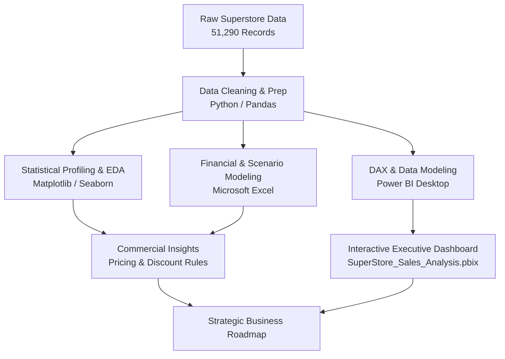

# 🛒 Global Superstore Sales, Profitability & Discount Analysis

[](https://www.python.org/)
[](superstore_orders_analysis.ipynb)
[](SuperStore_Sales_Analysis.pbix)
[](superstore_excel_analysis.xlsx)
[](https://pandas.pydata.org/)
[](https://seaborn.pydata.org/)
[](https://github.com/Megharaju-Vakiti/superstore-sales-analysis)
[](LICENSE)

> **An end-to-end retail business analytics and commercial intelligence project evaluating 51,290 global orders across 147 countries. Combines Python (EDA & statistical analysis), Microsoft Excel (pivot modeling), and Power BI (executive dashboard) to diagnose profit leakages, uncover pricing discount traps, and map multi-year revenue growth.**

---

## 📌 Table of Contents

- [Executive Summary](#-executive-summary)
- [Project Overview & Core Objectives](#-project-overview--core-objectives)
- [Key Business Metrics (KPIs)](#-key-business-metrics-kpis)
- [Dataset Architecture & Schema (21 Columns)](#-dataset-architecture--schema-21-columns)
- [Technology Stack & Workflow Pipeline](#-technology-stack--workflow-pipeline)
  - [1. Data Extraction, Cleaning & Preprocessing (Python)](#1-data-extraction-cleaning--preprocessing-python)
  - [2. Exploratory Data Analysis & Statistical Profiling](#2-exploratory-data-analysis--statistical-profiling)
  - [3. Financial & Pivot Modeling (Excel)](#3-financial--pivot-modeling-excel)
  - [4. Business Intelligence Dashboard (Power BI)](#4-business-intelligence-dashboard-power-bi)
- [Deep Dive: Key Findings & Business Insights](#-deep-dive-key-findings--business-insights)
  - [1. The Discount vs. Profitability Dilemma](#1-the-discount-vs-profitability-dilemma)
  - [2. Category & Margin Divergence](#2-category--margin-divergence)
  - [3. Multi-Year Sales Growth & Holiday Seasonality](#3-multi-year-sales-growth--holiday-seasonality)
  - [4. Customer Segmentation & Revenue Concentration](#4-customer-segmentation--revenue-concentration)
  - [5. Geographic & Regional Profit Drivers](#5-geographic--regional-profit-drivers)
- [Strategic Business Recommendations](#-strategic-business-recommendations)
- [Repository Structure](#-repository-structure)
- [How to Run & Reproduce](#-how-to-run--reproduce)
- [Author & Contact](#-author--contact)

---

## 🚀 Executive Summary

Retail profitability depends on striking the right balance between sales volume, pricing strategy, product mix, and logistics costs. This project conducts an in-depth empirical investigation into **51,290 commercial transactions** from the **Global Superstore** spanning four consecutive operating years (2011–2014) across **7 global markets** and **147 countries**.

Through exploratory programming in **Python** (`pandas`, `numpy`, `matplotlib`, `seaborn`), financial scenario modeling in **Microsoft Excel**, and interactive visualization in **Power BI**, the analysis pinpoints critical commercial vulnerabilities:
1. **The Promotional Trap:** Heavy discounts (>20%) fail to drive sustainable volume while drastically eroding net margin, turning profitable lines into loss leaders.
2. **Category Margin Disparities:** While **Technology** drives high absolute dollar profit, **Office Supplies** commands the highest margin efficiency, whereas **Furniture** suffers from steep margin compression due to freight and markdown issues.
3. **Q4 Demand Concentration:** Annual sales demonstrate persistent Q4 seasonality (surging in October–December), demanding optimized inventory and fulfillment staging.

---

## 🎯 Project Overview & Core Objectives

- **Examine Multi-Year Revenue Trajectory:** Measure YoY sales growth, identify monthly demand seasonality, and uncover expansion cycles.
- **Deconstruct Category & Sub-Category Profitability:** Uncover high-performing revenue engines vs. unprofitable, loss-making product sub-categories.
- **Evaluate the Impact of Promotional Discounting:** Quantify how discount levels directly affect gross profit margins and determine optimal discount thresholds.
- **Analyze Customer Segments & Purchasing Behavior:** Compare the revenue contribution and order sizes of Consumer, Corporate, and Home Office buyers.
- **Identify Regional Logistics & Geographic Variances:** Pinpoint markets generating top profits vs. regions burdened with high shipping expenses.
- **Build an Executive Decision-Making System:** Deliver an interactive Power BI dashboard and Excel model for ongoing commercial monitoring.

---

## 📈 Key Business Metrics (KPIs)

| Business Metric | Value / Scale | Analytical Takeaway |
| :--- | :---: | :--- |
| **Total Global Orders** | **51,290 transactions** | Robust sample covering 4 operating years (2011–2014) |
| **Global Geographic Reach** | **147 Countries / 7 Markets** | APAC, EU, US, LATAM, EMEA, Africa, and Canada |
| **Customer Base** | **795 Unique Customers** | High repeat-purchase rate across Consumer & B2B segments |
| **Product Portfolio** | **10,292 Unique SKUs** | Spans 3 Categories & 17 distinct Sub-Categories |
| **Mean Quantity per Order** | **3.48 units** | Median basket size stable across segments |
| **Average Promotional Discount** | **14.29%** | Standard promotional discount across product lines |
| **Average Profit per Order** | **$28.64** | Healthy baseline profitability across total catalog |
| **Average Shipping Cost per Order** | **$26.38** | Fulfillment expense accounts for significant operational outlay |
| **Top Revenue Category** | **Technology** | Leading sales volume and absolute dollar profit |
| **Highest Margin Efficiency** | **Office Supplies** | Highest profit margin percentage relative to revenue |

---

## 🗂️ Dataset Architecture & Schema (21 Columns)

The dataset contains 51,290 records across 21 business-critical fields:

| # | Column Name | Data Type | Description |
| :--: | :--- | :--- | :--- |
| 1 | `order_id` | String | Unique transaction identifier (e.g., `AG-2011-2040`) |
| 2 | `order_date` | Date | Date when transaction was logged (converted to `datetime`) |
| 3 | `ship_date` | Date | Fulfillment / dispatch date |
| 4 | `ship_mode` | String | Shipping tier: *Standard Class, Second Class, First Class, Same Day* |
| 5 | `customer_name` | String | Customer full name (795 unique customers) |
| 6 | `segment` | String | Customer cohort: *Consumer, Corporate, Home Office* |
| 7 | `state` | String | Geographic province / state (1,094 distinct states) |
| 8 | `country` | String | Country of purchase (147 distinct countries) |
| 9 | `market` | String | Macro trade market: *APAC, EU, US, LATAM, EMEA, Africa, Canada* |
| 10 | `region` | String | Regional territory (13 distinct geographic regions) |
| 11 | `product_id` | String | Unique product catalog code (10,292 products) |
| 12 | `category` | String | High-level vertical: *Technology, Furniture, Office Supplies* |
| 13 | `sub_category` | String | Granular product line (Phones, Copiers, Chairs, Storage, etc.) |
| 14 | `product_name` | String | Detailed product title |
| 15 | `sales` | Float | Gross order revenue in USD |
| 16 | `quantity` | Integer | Total units ordered |
| 17 | `discount` | Float | Percentage markdown applied (`0.0` to `0.80`) |
| 18 | `profit` | Float | Net profit / earnings generated in USD (can be negative) |
| 19 | `shipping_cost` | Float | Logistics and handling charge in USD |
| 20 | `order_priority` | String | Priority status: *Critical, High, Medium, Low* |
| 21 | `year` | Integer | Order calendar year (*2011, 2012, 2013, 2014*) |

---

## 🛠️ Technology Stack & Workflow Pipeline



### 1. Data Extraction, Cleaning & Preprocessing (Python)
- **Missing Value Handling:** Identified a single missing value in `product_name` across 51,290 rows and cleaned the dataset with `df.dropna(inplace=True)`.
- **Type Conversions:** Formatted `order_date` from string (`%d-%m-%Y`) to standardized `datetime64[ns]`, parsed calendar year and monthly periods (`dt.to_period('M')`), and cast `sales` and `profit` to float64 numeric arrays.
- **Engineered Metrics:** Calculated transaction-level **Profit Margin** via:
  $$\text{Profit Margin} = \frac{\text{Profit}}{\text{Sales}}$$

### 2. Exploratory Data Analysis & Statistical Profiling
- Extracted statistical distribution metrics (`mean`, `std`, `IQR`, `quantiles`) across numerical features.
- Generated scatter plots to identify inflection points between `discount` and `profit`.
- Evaluated correlation matrices via Seaborn heatmap to uncover interdependencies between pricing, volume, freight costs, and profitability.

### 3. Financial & Pivot Modeling (Excel)
- Configured multi-dimensional pivot tables in `superstore_excel_analysis.xlsx`:
  - Category and Sub-Category revenue share vs. margin generation.
  - Segment performance matrices cross-tabulated with fulfillment priorities.
  - Discount banding tables to detect margin leakage thresholds.

### 4. Business Intelligence Dashboard (Power BI)
- Engineered in `SuperStore_Sales_Analysis.pbix` with clean layout and interactive filters:
  - **KPI Scorecards:** Total Sales, Total Profit, Gross Orders, Average Discount %, and Profit Margin %.
  - **Dynamic Visuals:** Sales by Category/Segment (Clustered Bars), Monthly Sales Trajectory (Area Chart), Regional Profit Distribution (Filled Map / Treemap), and Top Products Matrix.
  - **Drill-down Slicers:** Filterable by Year, Market, Region, Segment, and Product Vertical.

---

## 🔍 Deep Dive: Key Findings & Business Insights

### 1. The Discount vs. Profitability Dilemma

```
Profit ($)
  ▲
  │   ●  ●  ●  ● (Discounts 0% - 15%: High, Sustainable Profit)
  │    ●  ●   ●  ●
──┼──────────────────────────────────────► Discount Rate (%)
  │           ●   ●  (Discounts 20%+: Profit Margin Drops Rapidly)
  │               ●   ●   ●   ● (Discounts 40% - 80%: Steep Negative Losses)
  ▼
```

- **Inverted Relationship:** Discounting does **not** guarantee proportional sales lift. While modest discounts (0–15%) maintain positive earnings, discounts exceeding **20% to 30%** frequently produce severe negative profits.
- **Deep Discount Trap:** Transactions discounted at 40%–80% consistently generated major operating losses, indicating that commercial sales teams were using steep discounts to close deals at the expense of profitability.

---

### 2. Category & Margin Divergence

| Product Category | Sales Volume | Profit Contribution | Profit Margin Efficiency | Strategic Assessment |
| :--- | :---: | :---: | :---: | :--- |
| **Technology** | **Highest** | **Highest** | Moderate | Primary revenue driver (Phones, Copiers, Accessories) |
| **Office Supplies** | Moderate | Strong | **Highest (%)** | Most resilient profit margins; steady repeat demand |
| **Furniture** | High | **Lowest** | Very Low / Risk of Loss | Bulky items (Tables, Bookcases) drag down net earnings |

- **Technology** generates the largest gross sales volume and highest absolute profit dollars, led by high-ticket items (Copiers, Phones).
- **Office Supplies** demonstrates the healthiest profit-to-sales ratio, showing consistent, high-margin, low-discount performance.
- **Furniture** is the most vulnerable category. High freight/shipping charges coupled with aggressive discounting result in multiple sub-categories operating at break-even or negative margins.

---

### 3. Multi-Year Sales Growth & Holiday Seasonality

```
Monthly Sales Trend (Illustrative Seasonality Curve)
Sales ($)
  ▲
  │                                    ╭───★ Peak (Nov - Dec)
  │                      ╭─╮          ╭╯
  │           ╭─╮       ╭╯ ╰─╮       ╭╯
  │    ╭─╮   ╭╯ ╰─╮   ╭─╯    ╰─╮   ╭─╯
  │  ──╯ ╰───╯    ╰───╯        ╰───╯
  └────────────────────────────────────────► Jan - Dec
```

- **Consistent YoY Expansion:** Sales showed consistent multi-year compounding growth from 2011 through 2014.
- **Pronounced Q4 Seasonality:** Order volume consistently dips in early Q1 (January–February) before climbing steadily through Q3 and spiking sharply in **October, November, and December** (holiday and commercial fiscal year-end procurement).

---

### 4. Customer Segmentation & Revenue Concentration

```
Revenue Distribution by Customer Segment:
┌───────────────────────────────────────┬────────────────────┬──────────────┐
│          Consumer (~51.5%)            │  Corporate (~30%)  │ Home Office  │
│          Primary Volume Driver        │  Steady B2B Value  │   (~18.5%)   │
└───────────────────────────────────────┴────────────────────┴──────────────┘
```

- **Consumer Segment:** Represents the majority share of both transactions and gross revenue (~50%+).
- **Corporate Segment:** Demonstrates larger average order values with consistent commercial re-orders.
- **Home Office:** Smallest absolute segment, but maintains favorable margins due to lower discount demands.
- **Customer Concentration:** The top 10 individual customers account for an outsized portion of total revenue, highlighting key enterprise relationships.

---

### 5. Geographic & Regional Profit Drivers
- **APAC and Europe (EU)** lead in global profitability, demonstrating strong pricing power and controlled shipping overhead.
- Certain emerging regions exhibit moderate sales volume but substantially lower net profit, primarily caused by elevated international freight/shipping costs (`shipping_cost`).

---

## 💡 Strategic Business Recommendations

```
┌───────────────────────────────────────────────────────────────────────────┐
│                    COMMERCIAL OPTIMIZATION ROADMAP                        │
├───────────────────────────────────────────────────────────────────────────┤
│ 1. DISCOUNT GOVERNANCE    Enforce automated price floors; cap discounts   │
│                           at 15–20% to eliminate loss-making orders.      │
│                                                                           │
│ 2. FURNITURE RECOVERY     Re-evaluate freight surcharges on bulky items   │
│                           (Tables/Bookcases) to restore margins.          │
│                                                                           │
│ 3. CROSS-SELLING ENGINE   Bundle high-margin Office Supplies with         │
│                           high-value Technology hardware purchases.       │
│                                                                           │
│ 4. SEASONAL STAGING       Align supply chain and warehouse staffing to    │
│                           capitalize on predictable Q4 demand spikes.     │
└───────────────────────────────────────────────────────────────────────────┘
```

1. **Implement Algorithmic Discount Thresholds:**
   - Place a hard cap on sales-rep discretionary discounting at **15%**. Any discount over 20% should require managerial margin approval to halt margin erosion.
2. **Restructure Furniture Logistics & Pricing:**
   - Shift shipping costs for heavy furniture sub-categories (Tables, Bookcases) to pass-through freight models rather than absorbing shipping costs into gross margins.
3. **Double Down on High-Margin Office Supplies:**
   - Introduce cross-selling algorithms that recommend high-margin Office Supplies (Binders, Storage, Paper) alongside high-ticket Technology items.
4. **Key Account Management (KAM) Retention:**
   - Establish dedicated account managers and exclusive SLA terms for the **Top 10 enterprise customers** who generate disproportionate sales volume.
5. **Q4 Supply Chain Staging:**
   - Increase warehouse safety stock in September to avoid stockouts and avoid expedited shipping cost surcharges during peak Q4 order surges.

---

## 📁 Repository Structure

```plaintext
superstore-sales-analysis/
├── SuperStore_Sales_Analysis.pbix   # Power BI Dashboard with interactive visualizations & DAX
├── superstore_excel_analysis.xlsx   # Comprehensive Excel workbook with Pivot Tables & Modeling
├── superstore_orders_analysis.ipynb # Jupyter Notebook with complete EDA, statistics & visualizations
└── README.md                        # Project documentation, data dictionary & business insights
```

---

## 💻 How to Run & Reproduce

### 1. Prerequisites
- **Python 3.8+** with the following packages:
  ```bash
  pip install pandas numpy matplotlib seaborn jupyter
  ```
- **Power BI Desktop** (Free download: [aka.ms/pbidesktop](https://aka.ms/pbidesktop))
- **Microsoft Excel** (2016 or later / Microsoft 365)

### 2. Running the Python Notebook
1. Clone this repository:
   ```bash
   git clone https://github.com/Megharaju-Vakiti/superstore-sales-analysis.git
   cd superstore-sales-analysis
   ```
2. Launch Jupyter Notebook:
   ```bash
   jupyter notebook superstore_orders_analysis.ipynb
   ```
3. Run all cells (`Cell` > `Run All`) to reproduce all 10 analytical charts and correlation heatmaps.

### 3. Interacting with the Power BI Dashboard
1. Open `SuperStore_Sales_Analysis.pbix` in Power BI Desktop.
2. Use interactive slicers (Year, Category, Region, Segment) to explore commercial trends and drill down into sub-category margins.

---

## 👤 Author & Contact

**Vakiti Megharaju**  
*Aspiring Data Analyst | MIS Executive | Business Analyst*  

- **GitHub:** [@Megharaju-Vakiti](https://github.com/Megharaju-Vakiti)  
- **Project Repository:** [Superstore Sales Analysis](https://github.com/Megharaju-Vakiti/superstore-sales-analysis)

---
*⭐ If you find this project informative or useful for your own analytics work, please consider starring the repository!*
